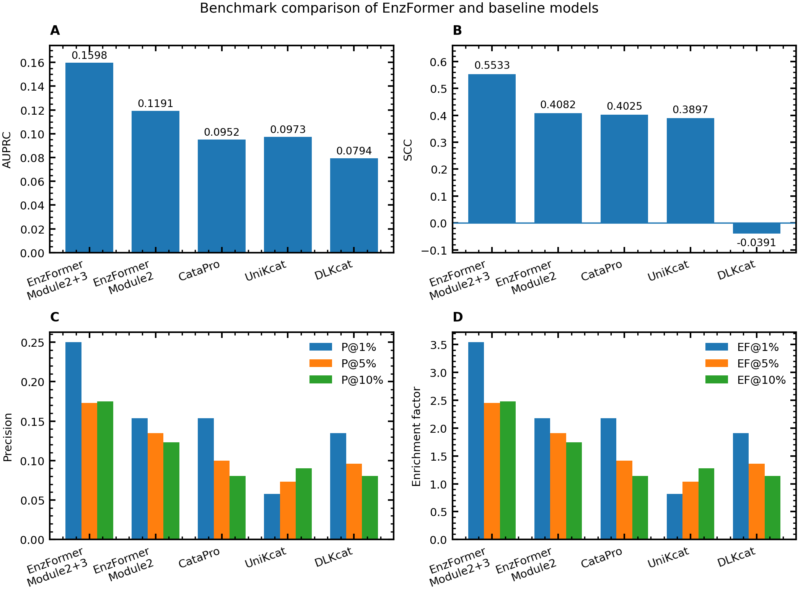

# EnzFormer2

EnzFormer2 is a follow-up to [EnzFormer](https://github.com/iungyu-snu/EnzFormer). It is designed to leverage large language models more effectively for enzyme engineering, with the goal of improving enzyme activity by predicting activity-enhancing variants.

## EcTL benchmark

The benchmark summary in this project was aligned to the shared comparison figure rather than to the later comparison bundle. In this version, the benchmark compares:

- `EnzFormer Module2+3`
- `EnzFormer Module2`
- `CataPro`
- `UniKcat`
- `DLKcat`

`EnzFormer Module2+3` shows the strongest overall performance in the shared benchmark figure, with the best AUPRC, SCC, and top-ranked enrichment behavior among the compared methods.

### Comparison snapshot

| Model | AUPRC | SCC | P@1% | P@5% | P@10% | EF@10% |
| --- | ---: | ---: | ---: | ---: | ---: | ---: |
| EnzFormer Module2+3 | 0.1598 | 0.5533 | 0.2500 | 0.1731 | 0.1750 | 2.4786 |
| EnzFormer Module2 | 0.1191 | 0.4082 | 0.1538 | 0.1346 | 0.1231 | 1.7432 |
| CataPro | 0.0952 | 0.4025 | 0.1538 | 0.1000 | 0.0808 | 1.1440 |
| UniKcat | 0.0973 | 0.3897 | 0.0577 | 0.0731 | 0.0904 | 1.2802 |
| DLKcat | 0.0794 | -0.0391 | 0.1346 | 0.0962 | 0.0808 | 1.1440 |

## Pipeline modules

### Module 1: data builder

Module 1 prepares the training-ready dataset from an enzyme type and a query sequence or FASTA input. It covers sequence collection, preprocessing, feature preparation, and label generation so that downstream training can start from a consistent dataset.

### Module 2: model selection

Module 2 trains and compares candidate predictors on the labeled dataset from Module 1. It defines the task schema, validates the inputs, runs staged hyperparameter search, and selects the final winning model configuration.

### Module 3: mutation screen

Module 3 uses the selected model to score mutation candidates and refine the final shortlist. It supports broad mutation screening as well as focused candidate evaluation, and can combine model scores with additional filtering steps to prioritize promising variants.
